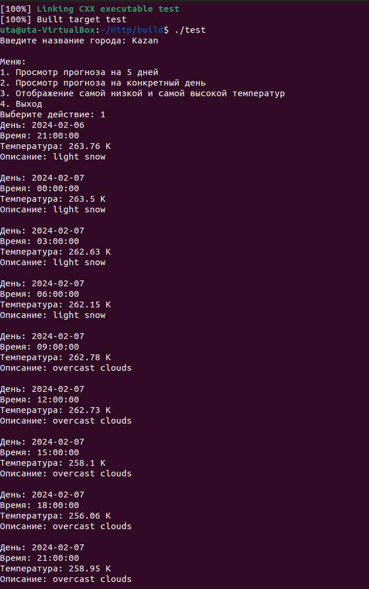
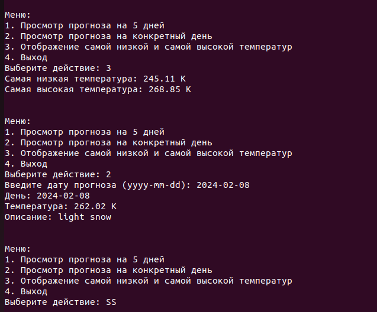

# Прогноз погоды

### Используемые библиотеки:
- libcurl
- nlohmann-json

### Структура DailyWeatherForecast:

- Хранит данные о погоде на конкретный день
- Состоит из полей date (дата), temperature (температура) и description (описание)

### Реализованные функции:
- writeCallback: 
Функция обратного вызова для записи полученного ответа от сервера в переменную.
Принимает указатель на полученные данные (ptr), размер каждого элемента (size), количество элементов (nmemb) и указатель на переменную, в которую нужно записывать данные (data).
Записывает полученные данные в переменную data и возвращает общий размер записанных данных.

- getWeatherForecast:
Выполняет запрос к API openweathermap.org для получения прогноза погоды.
Принимает название города (city).
Создает URL запроса, используя API ключ и название города.
Инициализирует объект CURL, который нужен для выполнения HTTP-запросов.
Устанавливает опции для CURL, включая URL, функцию обратного вызова и данные для записи ответа.
Выполняет запрос и записывает полученный ответ в переменную response.
Очищает объект CURL и возвращает ответ в формате JSON, преобразованный в объект json.
- fillWeatherForecast:
Заполняет список объектов DailyWeatherForecast из полученного прогноза погоды.
Принимает данные прогноза погоды (forecastData).
Создает пустой список weatherForecast для хранения данных о погоде.
Для каждого элемента в прогнозе погоды создает объект DailyWeatherForecast и заполняет его поля данными из прогноза.
Добавляет созданный объект DailyWeatherForecast в список weatherForecast.
Возвращает заполненный список weatherForecast.

### Функционал:
- Ввод указанного города 
- Просмотр погоды на на 5 дней
- Просмотр погоды на конкрутный день
- Просмотр самой низкой и самой высокой температуры

### Пример вывода:

